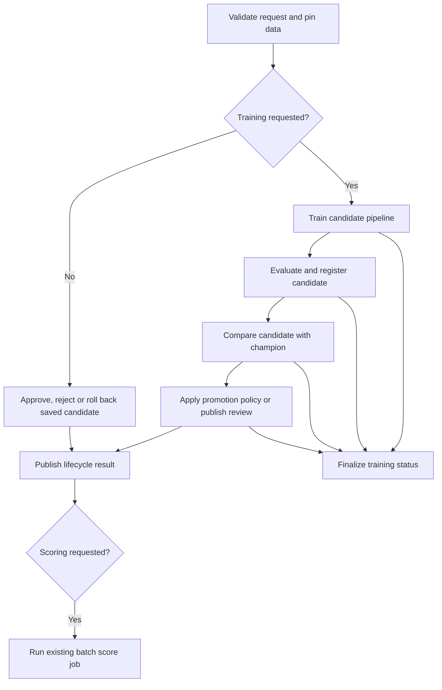

# SM-34A: Visible lifecycle tasks implementation plan

> **For agentic workers:** Use `subagent-driven-development` for implementation
> and independent review. Keep the existing `090` branch. Do not deploy or run
> cloud jobs as part of local implementation.

**Goal:** Make the Bundle graph explain the actual training, evaluation and
model decision work while preserving the two-job ownership model.

**Architecture:** Extract reusable phases from the current candidate-training
service. Notebook tasks exchange small references to evidence and artifacts
stored in the existing MLflow experiment. The existing serialized lifecycle job
remains the only alias writer; the existing score job remains the prediction
writer.

**Tech stack:** Core pandas/Polars pipelines, MLflow client/artifacts, Databricks
Python notebook tasks, Bundle YAML and pytest.

**Spec:** The accepted design and constraints in this document implement the
user's request for meaningful, understandable tasks instead of the current
`train -> should_score -> score_after_lifecycle` graph.

## Accepted design and constraints

- Exactly two jobs: lifecycle/train and score. No new Delta control tables.
- Use existing Core preprocessing, fitting, CV, evaluation and lifecycle APIs.
- Fit preprocessing only on training rows; retain fold-local CV and saved
  pre-split/custom-code replay. Both pandas and Polars remain supported.
- Pin configuration, project code, source version, time windows and expected
  champion once. Downstream phases must not reload editable project settings.
- Keep `train_local_candidate` as the sequential SDK entrypoint with its
  existing arguments and result; factor shared work rather than duplicate it.
- Do not register a candidate after failed initial holdout evaluation.
- Registration precedes nomination and registered-model comparison, as today.
  A later comparison failure retains the candidate and records the error.
- Manual approve/reject/rollback must bypass training and use saved evidence.
- Preserve champion versus pinned score selection, independent schedules,
  optional score handoff and existing committed-receipt checks.
- Retry count remains zero for lifecycle mutations. Reject repairs/retries of
  staged lifecycle runs initially; operators can start a fresh run after
  inspecting any uncertain mutation. Do not claim exactly-once registration.
- Preserve original exceptions and distinguish failed, incomplete and successful
  MLflow work. A failed display must not cause a mutation retry.
- New notebooks are thin fixed-phase entrypoints. Do not accept a user-supplied
  phase or role capable of turning score into an alias writer.
- English code, documentation, diagrams and visible task descriptions.
- No serving/canary tasks or native MLflow Deployment Jobs in this change.

## Intended graph

`Finalize training status` handles successful and unsuccessful training paths;
it must not mark a completed promotion failed merely because the child score
failed. Routing tasks have real conditions, not placeholder Python calls.
The result task combines verified receipts, human-readable decisions and manual
operator inputs; it must never synthesize success from missing output.

## File map

| Area | Existing files / responsibility |
| --- | --- |
| Candidate computation | `skyulf-core/skyulf/integrations/databricks/local_retraining.py`: validation, source read, split, CV, fit, holdout metrics, registration and comparison |
| Shared workflow selection | `.../databricks/local_workflow.py`: source/champion selection and strict automatic promotion replay |
| Durable task execution | New `.../databricks/lifecycle_tasks.py`: pinned invocation, phase receipts, dispatch and status finalization |
| Notebook boundary | `.../databricks/job_runtime.py`: config loading, role/parameter validation, readable output and task values |
| Artifact loading | `.../mlflow/registry.py`: reuse verified local package loading for an unregistered run artifact |
| Lifecycle state | `.../mlflow/challenger.py`: restore an exact nominated candidate for failure reporting without nominating it again, only if needed |
| Template | `skyulf-core/templates/databricks/template/{{.project_name}}/resources/workflow.jobs.yml.tmpl`, `src/` entrypoints, README |
| Graph guard | `.../databricks/workflow_config.py`: explicit generated graph contract version |
| Tests | Existing integration suites plus `test_databricks_lifecycle_tasks.py` |
| User guide | `docs/user_guide/databricks_bundle_walkthrough.md`, changelog and this initiative queue |

## Task 1: Shared candidate phases and durable orchestration

The candidate helpers and their durable adapter form one cohesive refactor;
do not land a second training implementation or expose an unverified graph.

- [x] Add failing tests for the stage order and an artifact round-trip with
  temporary directories destroyed between calls, on pandas and Polars.
- [x] Extract computation phases from `train_local_candidate`; retain the SDK
  wrapper, callback ordering, metrics, original/effective config artifacts and
  saved training evidence. Keep existing monkeypatch/test contracts where they
  reflect real API behavior.
- [x] Add a checked run-artifact loading path sharing package validation with
  registered-model loading. No fake registered reference for an unregistered fit.
- [x] Implement `run_lifecycle_phase(spark, *, phase, context, ...)` behind thin
  fixed notebook entrypoints. Finalize the exact Python signature in code and
  record it here before wiring templates.
- [x] Store versioned request and phase receipts in MLflow, bound to job ID,
  job run ID, resolved config and predecessor identity. Task values carry run
  ID/reference/digest only; never model objects, frames or local temporary paths.
- [x] Persist the fitted package and membership evidence before leaving train.
  Evaluation and comparison reconstruct the pinned heldout frame and check the
  existing saved evidence and model engine/digest/project-code identity.
- [x] Require a successful evaluation before registration; persist registration
  intent before mutation and the concrete result before nomination/comparison.
  Missing completion evidence after an attempted mutation is an unknown outcome,
  never permission to register again.
- [x] Reuse `_automatic_promotion` and existing operator services. Restore failure
  reporting from a verified registration receipt without changing aliases.
- [x] Implement explicit training-run status finalization; unsuccessful earlier
  phases cannot publish a successful result or request scoring. Finalizer failure
  leaves an explicit incomplete state, not a fabricated success.
- [x] Run focused real MLflow tests and existing CV/pre-split/lifecycle suites.

## Task 2: Generated graph, readable reports and contract validation

- [x] Add tests of the generated graph, fixed roles, branches and missing/stale
  task evidence before template implementation.
- [x] Wire real phase entrypoints and conditional routing in the same train job;
  retain serialization, queue, schedules, environments and score job identity.
- [x] Pass job/run/repair/retry references explicitly and reject unsupported
  repaired lifecycle execution before side effects. Verify raw/unresolved values
  fail clearly. This is not a security boundary against workspace editors.
- [x] Bump generated graph contract, keeping independent workflow config schema
  version unchanged unless its shape actually changes.
- [x] Join the mutually exclusive successful branches with supported `run_if`
  semantics. Use a genuine all-done finalizer for training; do not let a missing
  task value on an excluded branch turn success into failure.
- [x] Preserve separate report and notebook-exit cells. Each meaningful stage
  displays its own concise evidence, and final output retains copyable manual
  approval/rejection/rollback parameters.
- [x] Update the English walkthrough with the actual Mermaid graph, per-task
  responsibilities, failure behavior, repair limits and scoring handoff.
- [x] Run the affected integration suites, actual CLI template-generation tests,
  strict generated Bundle validation, Ruff/format, full type check and strict docs.
- [x] Obtain independent review of computation, lifecycle correctness, graph and
  failure handling. Record local versus live status; do not claim cloud acceptance.

## Required failure coverage

- Changed source version, config, project code, membership or model digest;
  foreign invocation and missing predecessor evidence.
- CV/fit/evaluation failure: no UC registration or promotion.
- Registration response lost: no automatic duplicate registration.
- Comparison failure after nomination: candidate retained with error status.
- Manual actions: no fitting, reading current project Python or registration.
- Rejected/pending/no-change decision: no score handoff.
- Committed promotion followed by score failure: promotion stays committed.
- Databricks repair/retry: fail before mutation with actionable fresh-run guidance.
- Display failure: successful action remains successful with machine-readable output.

## References and verification boundaries

- [Databricks task dependencies](https://docs.databricks.com/aws/en/jobs/run-if):
  excluded branches count as successful; all-excluded dependency chains remain
  excluded. `ALL_DONE` supports cleanup independently of upstream success.
- [Task values](https://docs.databricks.com/aws/en/jobs/task-values): small JSON
  values have a 48 KiB limit; prefer references to saved artifacts.
- [Dynamic references](https://docs.databricks.com/aws/en/jobs/dynamic-value-references):
  job/run identity, repair counts and execution metadata can be passed explicitly.

Current checkpoint: `676feddf` contains quality fixes and SM-34, verified with
647 tests passing, one optional Spark skip, strict docs and applicable commit
hooks. This plan is subsequent work and is not part of that commit.

## Local implementation evidence

Both tasks are implemented and independently reviewed. Final cross-task
review approved the combined change with no blocking findings. The generated graph has 11
lifecycle tasks and one score task across exactly two jobs.

The adapter interface is `run_lifecycle_phase(spark, *, phase, context,
tracking_uri, reference=None, config=None, action=None, experiment_name=None,
operator_options=None, now=None) -> LifecyclePhaseResult`. `LifecycleContext`
binds positive job/run IDs, repair count 0 and execution count 1. Results contain
a small JSON reference and a separate readable output dictionary. Prepare is
the only phase accepting editable settings; finalize/result consume its reference
to avoid references to excluded branches. Persistence lives in the focused
`_lifecycle_state.py` helper; computation orchestration lives in `lifecycle_tasks.py`.

Verified locally (these suites overlap; do not sum the counts):

- 354 relevant Core/MLflow tests passed; seven existing deprecation/single-row
  metric warnings. Final staged suite: 27 genuine SQLite MLflow cases passed,
  including pandas/Polars, saved custom code/CV, lost registration responses,
  failed evaluation, manual actions and finalization failures.
- Final notebook/template/config/output/project boundary suite: 223 passed,
  with two existing registry-alias deprecation warnings.
- All 63 installed-CLI template generation cases passed.
- Strict generated dev Bundle validation passed using the selected `skyulf`
  profile, without deployment or job execution.
- Full repository type check, scoped Ruff/format across 75 integration files,
  whitespace validation and strict documentation build passed.
- Review found that nested comparison/decision output was initially hidden in
  technical JSON. Shared readable summaries and three regression tests fixed it;
  the reviewer approved the scoped correction.

Final validation wheel: `.cache/sm34a-cli-all/test_cli_emits_independent_pol0/`
`output/sm33_generated/dist/skyulf_core-0.9.0-py3-none-any.whl`.
All 250 Core Python files matched the wheel byte-for-byte.
SHA-256: `df64ab9da201ae635c7d1b5b59d2204cbb768b008ae83f5ca78de2d507275113`.

**Live boundary:** No SM-34A job was deployed or executed on Databricks. Local
MLflow and CLI evidence does not establish serverless/Unity Catalog acceptance
of this new multi-task graph. Existing live deployments still have their old
graph until regenerated and deployed with the matching wheel and notebooks.
The readable final result and operator inputs are now in `publish_result`.
