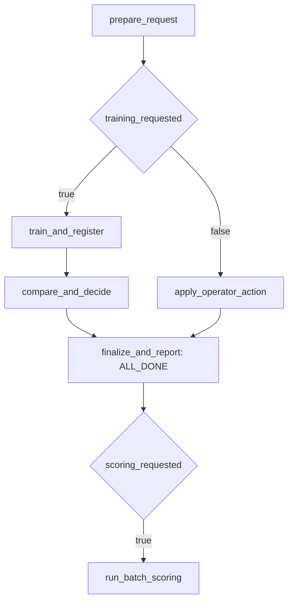

# SM-34B: Simplified lifecycle graph

Status: DONE; user-authorized live acceptance passed, 2026-09-26/27.
See [live rehearsal](rehearsals/sm34b_live/README.md). Baseline: `3e92d14a` on `090`, including the
existing uncommitted single-training-action and SM-34A live-join fixes.

The user requested this simplification after inspecting the eleven-task live
graph and explicitly resumed SM-34B. Implementation stays in the existing
working tree and preserves the earlier changes. The user subsequently requested
live Databricks acceptance followed by a commit; that evidence is recorded below.

## Design and context map

Reduce the lifecycle job from eleven tasks to eight and its dependency edges
from fifteen to eight. The two persistent jobs and their serialization stay
the same. Grouping reuses the existing durable MLflow phases and does not change
their predecessor receipts, model registration checks or saved-data replay.



| File | Change and dependency |
| --- | --- |
| `skyulf-core/skyulf/integrations/databricks/lifecycle_tasks.py` | Fixed groups invoke existing durable phases; shared completion finalizes training then verifies the result |
| `skyulf-core/skyulf/integrations/databricks/job_runtime.py` | Publish score request and final report for successful grouped completion |
| `skyulf-core/skyulf/integrations/databricks/job_output.py` | Readable group titles and manual-review decision |
| `skyulf-core/templates/databricks/template/{{.project_name}}/resources/workflow.jobs.yml.tmpl` | Eight tasks with only immediate dependencies; shared ALL_DONE completion |
| `skyulf-core/templates/databricks/template/{{.project_name}}/databricks.yml.tmpl` | Synchronize the renamed notebooks |
| `skyulf-core/templates/databricks/template/{{.project_name}}/src/` | Fixed group notebooks; remove superseded single-phase notebooks |
| `skyulf-core/tests/integrations/test_databricks_lifecycle_tasks.py` | Real MLflow group round trips, failures, manual actions and receipt guards |
| `skyulf-core/tests/integrations/test_databricks_lifecycle_notebook.py` | Fixed entry points, final output and failed-completion handoff guard |
| `skyulf-core/tests/integrations/test_databricks_bundle_generation.py` | Real CLI graph generation across selection, promotion, handoff and compute choices |
| Bundle guides and generated README | Current graph, task names and failure behavior |

Reference contracts remain in `_lifecycle_state.py`, `local_retraining.py` and
`local_workflow.py`. No database migration or user configuration field is needed.
Existing phase callers remain valid. Generated task names change, so operators
must regenerate the Bundle and start a fresh run; repair remains unsupported.

## Execution and recovery

1. Pin the eight-task graph and notebook behavior with failing tests.
2. Add fixed phase groups and retain every existing durable evidence guard.
3. Update the template and readable reports, then test both engines, branches
   and failure paths. Run real CLI generation and strict validation.
4. Independently review the complete change and record exact validation below.

The common final task receives only the prepare reference. It runs after both
branch tails have settled. Training failures close the MLflow run as FAILED;
the result guard then raises instead of publishing a score request. Operator
failures likewise cannot publish a successful result. Quality rejection is a
successful evaluation with no promotion or score handoff. Child scoring remains
separate and cannot retroactively change a completed training run.

The shared completion also receives the two branch-tail
[Databricks result states](https://docs.databricks.com/aws/en/jobs/dynamic-value-references).
It requires `success` for the active branch and `excluded` for the inactive
branch before publishing a result. This covers a notebook output failure after
a durable decision was already saved: cleanup still happens, an existing
promotion is preserved, and scoring remains blocked.

[Databricks task dependency rules](https://docs.databricks.com/aws/en/jobs/run-if)
confirm ALL_DONE runs after failed or upstream-failed dependencies, while an
inactive excluded branch does not require a value. A fully excluded graph stays
excluded; preparation already closes its own partially created run on failure.

If checks fail, fix the group/template changes before changing queue status.
Preserve earlier dirty changes and inspect any committed model effects before
starting a fresh run.

## Verification record

Independent review reproduced a post-decision notebook-output failure that
could request scoring through the new ALL_DONE join. The explicit branch-state
guard addresses that finding. Scoped independent re-review passed: a real
notebook task-value failure after promotion emits no completion task values or
result receipt, while an upstream-failed branch still finalizes incomplete
training as FAILED. Existing promotion remains intact.

Red checks caught the old eleven-task graph, missing grouped notebooks/manual
review output, missing completion handoff, stale notebook sync entries and
missing branch-state parameters. The real MLflow task-state regression failed
with DID NOT RAISE before the guard, then its 18-case selection passed.

### Commands and results

Fresh pre-commit verification on the final implementation, 2026-09-26:

- Broad Databricks suite excluding the separate CLI-generation file:
  **735 passed, 16 optional skips, 16 warnings**, 313.35 seconds.
- Real CLI generation and strict validation: **63 passed**, 42.14 seconds.
- `python -m mkdocs build --strict`: passed, 5.84 seconds.
- Current live wheel SHA-256:
  `709372f64349386fb7404861a055b66a958100997f54f8a8d3ff1ad02cc04ac7`.

Logs are in `rehearsals/sm34b_live/`. The earlier verification stages below
explain the review/fix sequence; their overlapping counts are not additive.

The broad run started before the review guard was added. It passed 717 tests,
skipped 16 and emitted 16 warnings in 317.37 seconds. Final affected-file checks
below cover the guard and subsequent runtime typing adjustment; their counts
overlap the broad suite and must not be added as unique tests.

```powershell
$sm34bTests = @(Get-ChildItem skyulf-core/tests/integrations/test_databricks_*.py | Where-Object Name -ne 'test_databricks_bundle_generation.py' | ForEach-Object FullName)
python -m pytest @sm34bTests -q --tb=short --basetemp=initiatives/spark_and_mlflow/rehearsals/sm34b_local/pytest -p no:cacheprovider
```

Final notebook/runtime/output checks: 81 passed.

```powershell
python -m pytest skyulf-core/tests/integrations/test_databricks_lifecycle_notebook.py skyulf-core/tests/integrations/test_databricks_job_runtime.py skyulf-core/tests/integrations/test_databricks_job_output.py -q --tb=short --basetemp=initiatives/spark_and_mlflow/rehearsals/sm34b_local/final_notebooks -p no:cacheprovider
```

Final full lifecycle file: 83 passed in 158.59 seconds, including both engines,
automatic/manual training, manual approve/reject/rollback, quality rejection,
fit/evaluation/comparison/registration/finalization failures, changed evidence,
foreign/repeated references and post-decision notebook-output failures.

```powershell
.venv/Scripts/python.exe -m pytest skyulf-core/tests/integrations/test_databricks_lifecycle_tasks.py --basetemp=.tmp-sm34b-task-states-full -q --tb=short --show-capture=no
```

Final real CLI generation: 63 passed. Covers serverless/policy-cluster, both
promotion policies, both score selectors, both handoff settings, optional
schedules, fixed notebook paths/sync and dynamic branch-state references.

```powershell
$env:SKYULF_BUNDLE_CLI_TEST_PROFILE='skyulf'
python -m pytest skyulf-core/tests/integrations/test_databricks_bundle_generation.py -q --tb=short -p no:cacheprovider
```

Final type check and scoped lint/format checks passed:

```powershell
ty check backend skyulf-core/skyulf skyulf-core/tests run_skyulf.py celery_worker.py
ruff check skyulf-core/skyulf/integrations/databricks skyulf-core/tests/integrations/test_databricks_lifecycle_tasks.py skyulf-core/tests/integrations/test_databricks_lifecycle_notebook.py skyulf-core/tests/integrations/test_databricks_bundle_generation.py
ruff format --check skyulf-core/skyulf/integrations/databricks/lifecycle_tasks.py skyulf-core/skyulf/integrations/databricks/job_runtime.py skyulf-core/skyulf/integrations/databricks/job_output.py skyulf-core/tests/integrations/test_databricks_lifecycle_tasks.py skyulf-core/tests/integrations/test_databricks_lifecycle_notebook.py skyulf-core/tests/integrations/test_databricks_bundle_generation.py
git diff --check
```

The final generated project was created through `_generate_project` in the CLI
test module with its default initializer values, under
`rehearsals/sm34b_local/final_validation/output/sm33_generated`. The current
wheel build and strict validation passed:

```powershell
uv --cache-dir initiatives/spark_and_mlflow/rehearsals/sm34b_local/uv-cache build --wheel --no-build-isolation skyulf-core --out-dir initiatives/spark_and_mlflow/rehearsals/sm34b_local/final_validation/output/sm33_generated/dist
# Run from the generated project directory:
databricks bundle validate --strict -t dev --profile skyulf
```

Wheel SHA-256:
`bf3ed5e404ade842770ce808442b41af08c3ffa099af75b1260dc3de05bcda2c`.
An initial strict validation correctly rejected a project without its wheel;
the final validation above includes the newly built wheel. The default uv
cache was inaccessible in the sandbox, so the build used the shown local cache.

Runtime: Python 3.12.10, MLflow 3.16.1, pandas 2.3.2, Polars 1.44.1,
scikit-learn 1.8.0, pytest 9.1.1, Databricks CLI 1.17.0. The 16 skips are one
optional PySpark case and fifteen optional Delta-runtime cases. Warnings concern
existing Split/model-selection aliases, sklearn feature names and Polars Enum
casting. No new Spark or Delta transport behavior is claimed.

### Boundaries

At the local checkpoint, no cloud deployment or job run had been performed.
The subsequent authorized live rehearsal passed pandas automatic training,
Polars manual training/approval, both child-score handoffs, incremental/no-op
scoring, a failed fit and a notebook failure after committed promotion.
Read-only audit `683054016979330` verified MLflow phase receipts, cleanup,
preserved promotion, no scoring after either failure and unchanged historical
prediction rows. The local evidence verifier also passed.

The existing two jobs now use the eight-task graph, are idle with schedules
PAUSED, and have normal pandas configuration restored. See the linked live
record for every run, the initial infrastructure failure and final state.
Live reject/rollback, scheduled-clock firing and company acceptance remain
outside this rehearsal. Strict docs passed before the requested commit.
No frontend change. Next local implementation task: SM-35.

Commit scope includes the earlier single-training-action/version-selection
follow-up required by this graph. Unrelated staged `.gitignore` changes and
local model/runtime artifacts are excluded.
